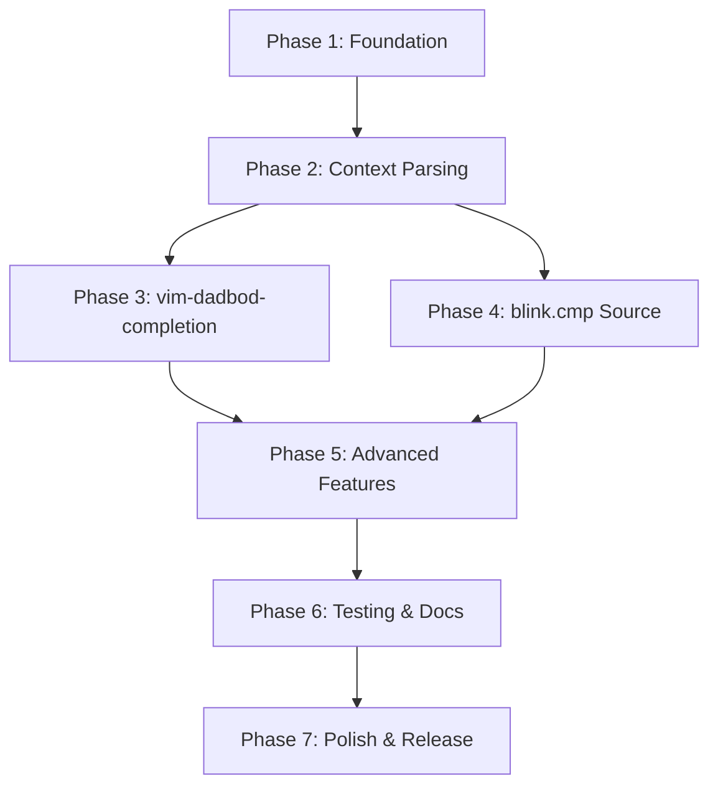

# SSMS-like IntelliSense Implementation Roadmap

## Executive Summary

This roadmap outlines the implementation plan for adding SSMS-style IntelliSense to vim-dadbod-ui. The feature will provide context-aware SQL completions based on database connections, external database references, and query context.

**Estimated Timeline**: 6-8 weeks
**Complexity**: High
**Required Forks**: 1 (vim-dadbod-completion)

---

## Repository Overview

### Repositories Involved

| Repository | Action Required | Owner | URL |
|------------|----------------|-------|-----|
| **vim-dadbod-ui** | ✅ Primary Implementation | You (fork already exists) | https://github.com/mikevskater/vim-dadbod-ui |
| **vim-dadbod-completion** | 🔧 Fork & Enhance | kristijanhusak | https://github.com/kristijanhusak/vim-dadbod-completion |
| **blink.cmp** | ℹ️ No Fork Needed (Create Source) | Saghen | https://github.com/Saghen/blink.cmp |
| **vim-dadbod** | ℹ️ No Changes Needed | tpope | https://github.com/tpope/vim-dadbod |

### Why Each Repository Needs Updates

**vim-dadbod-ui** (This Repo):
- Core completion cache infrastructure
- Database metadata enhancement
- Query context parsing
- External database detection and caching

**vim-dadbod-completion** (Fork Required):
- Enhanced to use vim-dadbod-ui's rich metadata
- External database reference support
- Improved completion item generation with metadata
- Better integration with blink.cmp

**blink.cmp** (No Fork - Just Create Source):
- Custom source provider that leverages vim-dadbod-ui
- Can be distributed as part of vim-dadbod-ui in `lua/blink/cmp/sources/`
- blink.cmp's architecture allows external sources without forking

---

## Implementation Phases

### Phase 1: Foundation (Week 1-2)
**Repository**: vim-dadbod-ui
**Goal**: Build completion cache infrastructure

#### Tasks

1. **Create `autoload/db_ui/completion.vim`** (Core Module)
   ```vim
   " Cache management functions
   function! db_ui#completion#init_cache(db_key_name)
   function! db_ui#completion#refresh_cache(db_key_name)
   function! db_ui#completion#clear_all_caches()
   function! db_ui#completion#get_completions(db_key_name, object_type, filter)

   " External database handling
   function! db_ui#completion#fetch_external_database(server_db_key, db_name)
   function! db_ui#completion#is_database_on_server(server_db_key, db_name)

   " Query context parsing
   function! db_ui#completion#get_cursor_context(bufnr, line, col)
   function! db_ui#completion#parse_database_references(query_text)
   ```

2. **Cache Structure Design**
   ```vim
   s:completion_cache = {
     'MyApp_DB_file': {
       'databases': [...],           " For server-level connections
       'schemas': [...],
       'tables': [...],
       'views': [...],
       'procedures': [...],
       'functions': [...],
       'columns_by_table': {
         'Users': [
           {'name': 'id', 'type': 'INT', 'nullable': 0, 'is_pk': 1},
           {'name': 'username', 'type': 'NVARCHAR(50)', 'nullable': 0}
         ]
       },
       'external_databases': {
         'OtherDB': { /* same structure */ }
       },
       'last_updated': timestamp,
       'ttl': 300
     }
   }
   ```

3. **Integration Hooks**
   - Modify `autoload/db_ui/query.vim` → `setup_buffer()` to initialize completion cache
   - Add autocmd to refresh cache when database structure changes
   - Expose cache via `db_ui#get_completion_info(db_key_name)` API

4. **Configuration Variables** (Add to `plugin/db_ui.vim`)
   ```vim
   let g:db_ui_enable_intellisense = get(g:, 'db_ui_enable_intellisense', 1)
   let g:db_ui_intellisense_cache_ttl = get(g:, 'db_ui_intellisense_cache_ttl', 300)
   let g:db_ui_intellisense_max_completions = get(g:, 'db_ui_intellisense_max_completions', 100)
   let g:db_ui_intellisense_show_system_objects = get(g:, 'db_ui_intellisense_show_system_objects', 0)
   let g:db_ui_intellisense_fetch_external_db = get(g:, 'db_ui_intellisense_fetch_external_db', 1)
   ```

5. **Commands** (Add to `plugin/db_ui.vim`)
   ```vim
   command! DBUIRefreshCompletion call db_ui#completion#refresh_cache(get(b:, 'dbui_db_key_name'))
   command! DBUIRefreshCompletionAll call db_ui#completion#clear_all_caches()
   command! DBUICompletionStatus call db_ui#completion#show_status()
   command! DBUICompletionDebug call db_ui#completion#toggle_debug()
   ```

**Deliverables**:
- ✅ Working completion cache with TTL
- ✅ Cache initialization on buffer creation
- ✅ Configuration variables and commands
- ✅ Unit tests for cache operations

**Testing**:
- Create `test/test-completion-cache.vim`
- Test cache initialization, TTL expiration, refresh, clear

---

### Phase 2: Query Context Parsing (Week 2-3)
**Repository**: vim-dadbod-ui
**Goal**: Detect cursor context and external database references

#### Tasks

1. **SQL Parser Implementation** (in `autoload/db_ui/completion.vim`)
   ```vim
   " Detect what type of completion is needed at cursor position
   function! s:detect_completion_context(line, col)
     " Returns: 'database', 'schema', 'table', 'column', 'procedure', 'keyword'
   endfunction

   " Parse table aliases from query
   function! s:parse_table_aliases(query_text)
     " Returns: {'u': 'Users', 'o': 'Orders'}
   endfunction

   " Extract database references (e.g., OtherDB.dbo.Users)
   function! s:extract_database_references(query_text)
     " Returns: ['OtherDB', 'ReportingDB']
   endfunction
   ```

2. **Context Detection Patterns**
   ```vim
   " Database context: USE DbName|, FROM DbName.|
   let s:db_context_pattern = '\v%(USE|FROM|JOIN|INTO)\s+\zs(\w+)\ze\.'

   " Schema context: DbName.schema.|
   let s:schema_context_pattern = '\v(\w+)\.(\w+)\.\zs'

   " Table/Column context: table.column, alias.column
   let s:column_context_pattern = '\v%(SELECT|WHERE|ON|AND|OR)\s+.*\zs(\w+)\.\ze\w*'

   " Table alias: FROM Users u, JOIN Orders o
   let s:alias_pattern = '\v%(FROM|JOIN)\s+(\S+)\s+%(AS\s+)?(\w+)'
   ```

3. **External Database Metadata Fetching**
   ```vim
   function! db_ui#completion#fetch_external_database(server_db_key, db_name) abort
     " 1. Check if db_name is on the same server
     " 2. Create temporary connection to that database
     " 3. Fetch metadata using db_ui#schemas#query_* functions
     " 4. Store in completion_cache under 'external_databases'
     " 5. Apply same TTL as main cache
   endfunction
   ```

**Deliverables**:
- ✅ SQL query parser that identifies cursor context
- ✅ Table alias resolution
- ✅ External database reference detection
- ✅ External database metadata caching

**Testing**:
- Create `test/test-completion-parser.vim`
- Test various SQL patterns (SELECT, JOIN, WHERE, external DB refs)

---

### Phase 3: vim-dadbod-completion Enhancement (Week 3-4)
**Repository**: vim-dadbod-completion (Fork Required)
**Goal**: Enhanced completion with vim-dadbod-ui integration

#### Fork Setup

```bash
# Fork https://github.com/kristijanhusak/vim-dadbod-completion on GitHub
git clone https://github.com/mikevskater/vim-dadbod-completion.git
cd vim-dadbod-completion
git remote add upstream https://github.com/kristijanhusak/vim-dadbod-completion.git
```

#### Tasks

1. **Create Enhanced Integration Module**
   - File: `autoload/vim_dadbod_completion/dbui.vim`
   ```vim
   " Check if vim-dadbod-ui is available
   function! vim_dadbod_completion#dbui#is_available() abort
     return exists('*db_ui#completion#get_completions')
   endfunction

   " Get enhanced completions from vim-dadbod-ui
   function! vim_dadbod_completion#dbui#get_completions(bufnr) abort
     let db_key_name = getbufvar(a:bufnr, 'dbui_db_key_name')
     if empty(db_key_name) | return {} | endif

     " Get cursor context
     let [line, col] = [line('.'), col('.')]
     let context = db_ui#completion#get_cursor_context(a:bufnr, line, col)

     " Fetch appropriate completions based on context
     return s:fetch_contextual_completions(db_key_name, context)
   endfunction
   ```

2. **Modify Main Completion Function**
   - File: `autoload/vim_dadbod_completion.vim`
   - Enhance `vim_dadbod_completion#fetch()` to check for vim-dadbod-ui
   ```vim
   function! vim_dadbod_completion#fetch(bufnr) abort
     " First try enhanced vim-dadbod-ui integration
     if vim_dadbod_completion#dbui#is_available()
       let enhanced = vim_dadbod_completion#dbui#get_completions(a:bufnr)
       if !empty(enhanced)
         return s:save_enhanced_to_cache(a:bufnr, enhanced)
       endif
     endif

     " Fallback to existing implementation
     let db_info = s:get_buffer_db_info(a:bufnr)
     return s:save_to_cache(a:bufnr, db_info.url, db_info.table, db_info.dbui)
   endfunction
   ```

3. **Enhanced Completion Items**
   - Add metadata to completion items (data types, nullability, FK info)
   - File: `autoload/vim_dadbod_completion/formatters.vim`
   ```vim
   function! s:format_column_item(column) abort
     return {
       \ 'word': a:column.name,
       \ 'kind': 'column',
       \ 'menu': printf('%s %s', a:column.type, a:column.nullable ? 'NULL' : 'NOT NULL'),
       \ 'info': s:build_column_info(a:column),
       \ 'user_data': {
       \   'is_pk': get(a:column, 'is_pk', 0),
       \   'is_fk': get(a:column, 'is_fk', 0),
       \   'data_type': a:column.type
       \ }
       \ }
   endfunction
   ```

4. **blink.cmp Adapter Enhancement**
   - File: `lua/cmp_dadbod/source.lua` (already exists in vim-dadbod-completion)
   - Add support for enhanced metadata from vim-dadbod-ui
   ```lua
   function source:complete(params, callback)
     local db_key_name = vim.b.dbui_db_key_name

     -- Use enhanced completions if available
     if vim.fn.exists('*db_ui#completion#get_completions') == 1 then
       local items = self:get_enhanced_completions(db_key_name, params)
       callback(items)
       return
     end

     -- Fallback to standard completions
     -- ... existing code ...
   end
   ```

**Deliverables**:
- ✅ Enhanced vim-dadbod-completion with vim-dadbod-ui integration
- ✅ Backward compatibility maintained (works without vim-dadbod-ui)
- ✅ Richer completion items with metadata
- ✅ External database reference support

**Testing**:
- Test completion with and without vim-dadbod-ui
- Test external database references
- Test metadata in completion items
- Ensure backward compatibility

---

### Phase 4: blink.cmp Source Provider (Week 4-5)
**Repository**: vim-dadbod-ui
**Goal**: Custom blink.cmp source for optimal performance

#### Tasks

1. **Create blink.cmp Source**
   - File: `lua/blink/cmp/sources/dadbod.lua` (in vim-dadbod-ui)
   ```lua
   local source = {}

   function source:new()
     return setmetatable({}, { __index = source })
   end

   function source:enabled()
     -- Enable for SQL buffers with vim-dadbod-ui connection
     return vim.bo.filetype == 'sql' and vim.b.dbui_db_key_name ~= nil
   end

   function source:get_trigger_characters()
     return { '.', ' ', '(', '[', '@' }
   end

   function source:get_completions(ctx, callback)
     local db_key_name = vim.b.dbui_db_key_name
     if not db_key_name then
       callback({ is_incomplete_forward = false, is_incomplete_backward = false, items = {} })
       return
     end

     -- Parse cursor context
     local line = ctx.line
     local col = ctx.cursor[2]
     local context = vim.fn['db_ui#completion#get_cursor_context'](0, line, col)

     -- Get completions based on context
     local object_type = self:determine_object_type(context)
     local raw_items = vim.fn['db_ui#completion#get_completions'](db_key_name, object_type, '')

     -- Transform to LSP completion items
     local items = self:transform_to_lsp_items(raw_items, context)

     callback({
       is_incomplete_forward = false,
       is_incomplete_backward = false,
       items = items
     })
   end

   function source:resolve(item, callback)
     -- Fetch additional details (column list for tables, procedure definition, etc.)
     if item.data and item.data.object_type == 'table' then
       local columns = vim.fn['db_ui#completion#get_completions'](
         item.data.db_key_name,
         'columns',
         item.data.table_name
       )
       item.documentation = self:build_table_documentation(columns)
     end
     callback(item)
   end

   return source
   ```

2. **LSP Completion Item Transformation**
   ```lua
   function source:transform_to_lsp_items(raw_items, context)
     local items = {}

     for _, item in ipairs(raw_items) do
       table.insert(items, {
         label = item.name,
         kind = self:get_lsp_kind(item.type),
         detail = self:build_detail(item),
         documentation = {
           kind = 'markdown',
           value = self:build_documentation(item)
         },
         insertText = self:build_insert_text(item),
         filterText = item.name,
         sortText = self:build_sort_text(item),
         data = {
           source = 'dadbod',
           db_key_name = vim.b.dbui_db_key_name,
           object_type = item.type,
           schema = item.schema,
           full_name = item.full_name
         }
       })
     end

     return items
   end

   function source:get_lsp_kind(object_type)
     local kinds = {
       database = require('blink.cmp.types').CompletionItemKind.Module,
       schema = require('blink.cmp.types').CompletionItemKind.Module,
       table = require('blink.cmp.types').CompletionItemKind.Class,
       view = require('blink.cmp.types').CompletionItemKind.Interface,
       column = require('blink.cmp.types').CompletionItemKind.Field,
       procedure = require('blink.cmp.types').CompletionItemKind.Function,
       ['function'] = require('blink.cmp.types').CompletionItemKind.Function,
       keyword = require('blink.cmp.types').CompletionItemKind.Keyword,
     }
     return kinds[object_type] or require('blink.cmp.types').CompletionItemKind.Text
   end
   ```

3. **Auto-Registration**
   - File: `plugin/db_ui.vim` (add blink.cmp registration)
   ```vim
   " Auto-register blink.cmp source if available
   if has('nvim') && exists('*luaeval')
     lua << EOF
       local ok, blink = pcall(require, 'blink.cmp')
       if ok then
         -- Register dadbod source
         vim.schedule(function()
           blink.setup({
             sources = {
               providers = {
                 dadbod = {
                   name = 'Dadbod',
                   module = 'blink.cmp.sources.dadbod',
                   enabled = true,
                 }
               }
             }
           })
         end)
       end
   EOF
   endif
   ```

**Deliverables**:
- ✅ Fully functional blink.cmp source
- ✅ LSP-style completion items
- ✅ Context-aware completions
- ✅ Auto-registration when blink.cmp is detected

**Testing**:
- Manual testing with blink.cmp in Neovim
- Test all completion contexts (database, schema, table, column, procedure)
- Test external database references
- Performance testing with large databases

---

### Phase 5: Advanced Features (Week 5-6)
**Repository**: vim-dadbod-ui
**Goal**: External database references and advanced query parsing

#### Tasks

1. **External Database Detection**
   ```vim
   function! s:detect_external_databases(query_text) abort
     " Pattern: DatabaseName.SchemaName.TableName or DatabaseName..TableName
     let pattern = '\v(\w+)\.%((\w+)\.)?(\w+)'
     let matches = []
     let pos = 0

     while 1
       let match = matchlist(a:query_text, pattern, pos)
       if empty(match) | break | endif

       let db_name = match[1]
       if db_name !=# current_database()
         call add(matches, db_name)
       endif

       let pos = match(a:query_text, pattern, pos) + 1
     endwhile

     return uniq(matches)
   endfunction
   ```

2. **Automatic External Database Caching**
   - Hook into query execution (autocmd User *DBExecutePre)
   - Parse query for external database references
   - Fetch metadata for external databases on-demand
   - Store in separate cache namespace

3. **Schema-Qualified Name Completion**
   - Complete after `DatabaseName.` → show schemas
   - Complete after `DatabaseName.SchemaName.` → show tables/views
   - Complete after `TableName.` or `Alias.` → show columns

4. **Alias Resolution**
   ```vim
   function! s:resolve_alias(alias, query_text) abort
     " Parse: FROM Users u, JOIN Orders o ON u.id = o.user_id
     " Returns: {'u': 'Users', 'o': 'Orders'}

     let aliases = {}
     let pattern = '\v%(FROM|JOIN)\s+%(((\w+)\.)?(\w+)\.)?(\w+)\s+%(AS\s+)?(\w+)'

     " Match all FROM/JOIN clauses
     let pos = 0
     while 1
       let match = matchlist(a:query_text, pattern, pos)
       if empty(match) | break | endif

       let table_name = match[5]
       let alias_name = match[6]
       let aliases[alias_name] = table_name

       let pos = match(a:query_text, pattern, pos) + 1
     endwhile

     return get(aliases, a:alias, '')
   endfunction
   ```

**Deliverables**:
- ✅ External database reference detection and caching
- ✅ Schema-qualified name completion
- ✅ Table alias resolution
- ✅ Multi-database JOIN support

**Testing**:
- Create `test/test-external-databases.vim`
- Test queries referencing multiple databases
- Test alias resolution with complex queries
- Test schema-qualified completions

---

### Phase 6: Testing & Documentation (Week 6-7)
**Repositories**: vim-dadbod-ui, vim-dadbod-completion
**Goal**: Comprehensive testing and documentation

#### Tasks

1. **Unit Tests** (vim-dadbod-ui)
   - `test/test-completion-cache.vim` - Cache operations
   - `test/test-completion-parser.vim` - Query parsing
   - `test/test-external-databases.vim` - External DB handling
   - `test/test-completion-integration.vim` - Full workflow

2. **Integration Tests**
   - Test with real databases (PostgreSQL, MySQL, SQL Server)
   - Test with vim-dadbod-completion
   - Test with blink.cmp
   - Test with multiple buffers and connections

3. **Performance Tests**
   - Large database (1000+ tables)
   - External database caching performance
   - Completion latency (<50ms target)
   - Memory usage with multiple cached databases

4. **Documentation Updates**

   **vim-dadbod-ui**:
   - Update `README.md` with IntelliSense section
   - Add to `doc/dadbod-ui.txt`:
     - New commands (`:DBUIRefreshCompletion`, etc.)
     - Configuration variables
     - Usage examples
     - Troubleshooting

   **vim-dadbod-completion**:
   - Update `README.md` with vim-dadbod-ui integration
   - Document enhanced features
   - Add configuration examples

5. **Example Configurations**
   ```vim
   " Full IntelliSense setup example
   let g:db_ui_enable_intellisense = 1
   let g:db_ui_intellisense_cache_ttl = 600  " 10 minutes
   let g:db_ui_intellisense_fetch_external_db = 1
   let g:db_ui_intellisense_show_system_objects = 0

   " With blink.cmp
   lua << EOF
   require('blink.cmp').setup({
     sources = {
       providers = {
         dadbod = {
           name = 'Dadbod',
           module = 'blink.cmp.sources.dadbod',
           score_offset = 100,  " Prioritize database completions
         },
         lsp = { name = 'LSP' },
         path = { name = 'Path' },
         buffer = { name = 'Buffer' },
       }
     }
   })
   EOF
   ```

**Deliverables**:
- ✅ Comprehensive test suite
- ✅ Updated documentation in all repositories
- ✅ Usage examples and recipes
- ✅ Troubleshooting guide

---

### Phase 7: Polish & Release (Week 7-8)
**Repositories**: All
**Goal**: Final polish and coordinated release

#### Tasks

1. **Performance Optimization**
   - Profile completion latency
   - Optimize cache lookups
   - Implement lazy loading for large object lists
   - Add pagination for 500+ items

2. **Error Handling**
   - Graceful degradation when vim-dadbod-ui not available
   - Handle connection failures
   - Cache corruption recovery
   - Clear error messages for users

3. **User Experience**
   - Loading indicators for slow metadata fetches
   - Progress notifications
   - Configurable completion behavior
   - Debug logging for troubleshooting

4. **Release Preparation**
   - Version bumps (follow semver)
   - CHANGELOG updates
   - GitHub releases with notes
   - Tag releases in all repos

5. **Community Communication**
   - Create announcement post
   - Update README badges/features
   - Submit PRs to upstream (if desired)
   - Share on r/neovim, Neovim Discourse

**Deliverables**:
- ✅ Polished, production-ready features
- ✅ Coordinated releases across repos
- ✅ Community announcements
- ✅ Upstream PR (optional)

---

## Dependency Graph



---

## Repository Fork Strategy

### vim-dadbod-completion

**Why Fork**:
- Need to add vim-dadbod-ui integration module
- Modify core completion fetching logic
- Add enhanced metadata support
- Want to maintain compatibility with upstream

**Fork Workflow**:
```bash
# 1. Fork on GitHub
# 2. Clone your fork
git clone https://github.com/mikevskater/vim-dadbod-completion.git
cd vim-dadbod-completion

# 3. Add upstream remote
git remote add upstream https://github.com/kristijanhusak/vim-dadbod-completion.git

# 4. Create feature branch
git checkout -b feature/vim-dadbod-ui-integration

# 5. Make changes (Phase 3 tasks)

# 6. Keep in sync with upstream
git fetch upstream
git rebase upstream/master

# 7. Push to your fork
git push origin feature/vim-dadbod-ui-integration
```

**Integration in User Config**:
```lua
-- User's lazy.nvim config
return {
  {
    'mikevskater/vim-dadbod-completion',
    branch = 'feature/vim-dadbod-ui-integration',
    dependencies = { 'tpope/vim-dadbod' },
  },
  {
    'mikevskater/vim-dadbod-ui',
    dependencies = { 'tpope/vim-dadbod' },
  }
}
```

**Upstream Contribution**:
- After testing, can submit PR to kristijanhusak/vim-dadbod-completion
- Propose as optional enhancement (backward compatible)
- Highlight benefits: richer completions, external DB support

---

## Testing Strategy

### Test Environments

1. **Local Development**
   - SQLite (lightweight, quick tests)
   - PostgreSQL (Docker container)
   - MySQL (Docker container)

2. **CI/CD** (GitHub Actions)
   - Automated test suite on push
   - Matrix testing: Vim 8.2, Neovim 0.9, Neovim 0.10
   - Multiple database types

### Test Databases

Create test schema with:
```sql
-- Multiple databases on same server (for external DB testing)
CREATE DATABASE App_DB;
CREATE DATABASE Reporting_DB;

-- App_DB schema
USE App_DB;
CREATE TABLE Users (id INT PRIMARY KEY, username VARCHAR(50));
CREATE TABLE Orders (id INT PRIMARY KEY, user_id INT, FOREIGN KEY (user_id) REFERENCES Users(id));

-- Reporting_DB schema
USE Reporting_DB;
CREATE TABLE Reports (id INT PRIMARY KEY, name VARCHAR(100));
```

### Manual Test Checklist

- [ ] Single database completion
- [ ] External database reference (`SELECT * FROM OtherDB.dbo.Table`)
- [ ] Schema-qualified names (`dbo.Users`, `myschema.mytable`)
- [ ] Column completion with aliases (`SELECT u.| FROM Users u`)
- [ ] Procedure parameter completion (`EXEC sp_Name @param|`)
- [ ] View column completion
- [ ] Function completion
- [ ] Cache TTL expiration and refresh
- [ ] Multiple buffers with different databases
- [ ] Performance with 1000+ tables
- [ ] Works with and without vim-dadbod-ui
- [ ] Works with different completion frameworks (blink.cmp, nvim-cmp)

---

## Configuration Examples

### Full Setup with blink.cmp

```lua
-- lazy.nvim
return {
  -- Database plugins
  { 'tpope/vim-dadbod' },
  {
    'mikevskater/vim-dadbod-completion',
    branch = 'feature/vim-dadbod-ui-integration',
    ft = { 'sql', 'mysql', 'plsql' },
  },
  {
    'mikevskater/vim-dadbod-ui',
    dependencies = { 'tpope/vim-dadbod' },
    cmd = { 'DBUI', 'DBUIToggle', 'DBUIAddConnection' },
    init = function()
      -- IntelliSense configuration
      vim.g.db_ui_enable_intellisense = 1
      vim.g.db_ui_intellisense_cache_ttl = 600  -- 10 minutes
      vim.g.db_ui_intellisense_fetch_external_db = 1
      vim.g.db_ui_intellisense_show_system_objects = 0

      -- Database connections
      vim.g.dbs = {
        { name = 'dev_server', url = 'sqlserver://localhost' },
        { name = 'local_pg', url = 'postgresql://localhost:5432/mydb' },
      }
    end,
  },

  -- Completion
  {
    'saghen/blink.cmp',
    dependencies = 'rafamadriz/friendly-snippets',
    version = 'v0.*',
    opts = {
      sources = {
        providers = {
          dadbod = {
            name = 'Dadbod',
            module = 'blink.cmp.sources.dadbod',
            score_offset = 100,  -- Prioritize DB completions
            enabled = true,
          },
          lsp = { name = 'LSP' },
          path = { name = 'Path' },
          snippets = { name = 'Snippets' },
          buffer = { name = 'Buffer' },
        },
      },
      keymap = { preset = 'default' },
    },
  },
}
```

---

## Risk Mitigation

### Technical Risks

| Risk | Likelihood | Impact | Mitigation |
|------|-----------|--------|------------|
| Performance degradation with large DBs | Medium | High | Implement pagination, lazy loading, aggressive caching |
| Parsing complex SQL fails | Medium | Medium | Start with simple cases, expand coverage incrementally |
| External DB fetching is slow | High | Medium | Async fetching, background cache warming, user notification |
| Cache invalidation bugs | Medium | High | Comprehensive testing, manual refresh commands, conservative TTL |
| Conflicts with upstream vim-dadbod-completion | Low | Medium | Maintain backward compatibility, optional integration |

### Project Risks

| Risk | Likelihood | Impact | Mitigation |
|------|-----------|--------|------------|
| Scope creep | Medium | Medium | Stick to roadmap phases, defer nice-to-haves |
| Timeline overrun | Medium | Low | Build incrementally, each phase delivers value |
| Upstream changes break fork | Low | Medium | Track upstream, automated sync checks |

---

## Success Metrics

### Technical Metrics
- ✅ Completion latency <50ms for cached results
- ✅ Cache hit rate >90% for repeated queries
- ✅ Memory usage <50MB for 1000 tables cached
- ✅ Test coverage >80%

### User Experience Metrics
- ✅ Completions appear within 100ms of trigger
- ✅ External database metadata fetched in <2s
- ✅ Context-aware completions accurate >95%
- ✅ Works with SQL Server, PostgreSQL, MySQL

### Adoption Metrics
- ✅ Documentation complete and clear
- ✅ Zero critical bugs in first month
- ✅ Positive community feedback
- ✅ GitHub stars increase

---

## Next Steps

1. **Review this roadmap** - Confirm phases, timeline, approach
2. **Fork vim-dadbod-completion** - Set up repository
3. **Start Phase 1** - Begin with completion cache infrastructure
4. **Set up test environment** - Docker containers for databases
5. **Create project board** - Track tasks in GitHub Projects
6. **Regular check-ins** - Review progress weekly, adjust as needed

---

## Questions & Decisions Needed

Before starting implementation:

1. **Timeline**: Is 6-8 weeks realistic for your schedule?
2. **Databases**: Which database types to prioritize? (SQL Server, PostgreSQL, MySQL?)
3. **Upstream PRs**: Do you want to contribute back to kristijanhusak/vim-dadbod-completion?
4. **Testing**: Set up CI/CD from the start or add later?
5. **Beta Testing**: Want to recruit beta testers from community?

---

## Resources

### Documentation Links
- **vim-dadbod**: https://github.com/tpope/vim-dadbod/blob/master/doc/dadbod.txt
- **vim-dadbod-completion**: https://github.com/kristijanhusak/vim-dadbod-completion
- **blink.cmp docs**: https://cmp.saghen.dev/
- **vim-themis**: https://github.com/thinca/vim-themis

### Community Resources
- **r/neovim**: Share progress, get feedback
- **Neovim Discourse**: Technical discussions
- **vim-dadbod Gitter**: Direct plugin support

---

**Last Updated**: 2025-10-21
**Status**: Planning Phase
**Next Review**: After Phase 1 completion
